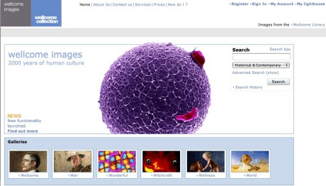

# wellcomeimages.org

The Wellcome Images website was a collection of images about the history of medicine and human health.
It was shut down in November 2017, in favour of our new image search at <https://wellcomecollection.org/works>.

This repo has the code for redirecting users and URLs to the new site.

## How we redirect users

*   URLs for an individual image are redirected to the corresponding image page on /works (if it exists)

*   URLs for searches or galleries are redirected to a search on /works

*   Otherwise, the user is redirected to an empty search page

## How it works

*   There's a CloudFront distribution for wellcomeimages.org in the experience account.

*   The CloudFront distribution is connected to a Lambda@Edge function (defined in edge-lambda), which decides where to redirect the user.

    (We use Lambda@Edge instead of CloudFront Functions because we sometimes need to make HTTP requests before doing a redirect. e.g. looking up an image ID from a URL so we can find the appropriate works page.
    Also, this work was completed several years before CloudFront Functions were released.)

*   The Route 53 hosted zone for wellcomeimages.org is defined in a D&T account.
    We create DNS records in that hosted zone that point to our CloudFront distributions.
