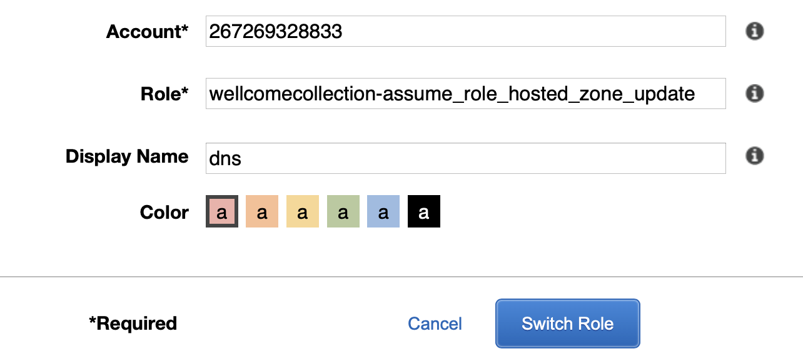

# How to get to the Route 53 Hosted Zone

The Route 53 Hosted Zone for wellcomelibrary.org is defined in an AWS account managed by D&T.

You can get to the Hosted Zone by assuming the following role: `arn:aws:iam::267269328833:role/wellcomecollection-assume_role_hosted_zone_update`.

You can see the Hosted Zone by going to <https://us-east-1.console.aws.amazon.com/route53/v2/hostedzones#ListRecordSets/Z3TXBL5I2YRXXX>

(You can't find the hosted zone in the Route 53 console because we don't have the ListHostedZones permission – some of them are for domains we don't control.)
